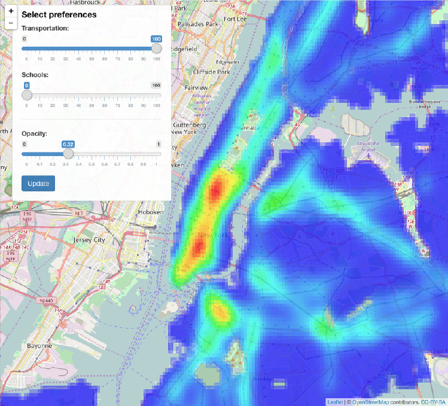

### Choose your zone NYC: example app screenshot

\

\

**This is an example output given by the app when setting a preference entirely focused on transportation ("Transportation" weight = 100 ; "Schools" weight = 0). The app color-codes the New York City map according to distance to subway stations. The number of subway lines running through a given station is taken into account, with the weight of a station being proportional to its number of subway lines.** 
**Not surprisingly, Midtown and Downtown Manhattan offer the best transportation. However, Downtown Brooklyn and Long Island City in Queens appear to be good second options for users for whom good transportation is a major criterion in choosing a place to live.**